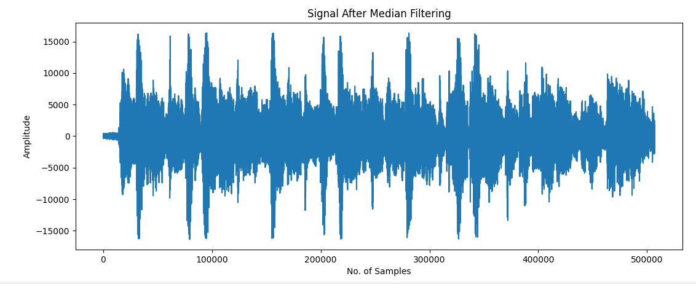
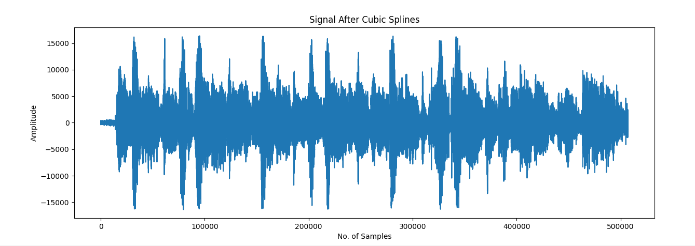

# Different interpolation methods for audio restoration

## High-level Description of the project

This assignment builds on Assignment I. We assume that we have successfully detected the clicks and we are applying different interpolation methods to restore the audio, such as 
- median filtering
- cubic splines

---

## Installation and Execution                 
          
matplotlib==3.6.2
numpy==1.23.4
playsound==1.2.2
scipy==1.9.3
tqdm==4.64.1

Afer installing all required packages you can run the demo file simply by typing:

    python main_me.py

    python main_cu.py

If you need to test the results of the median filtering method, you can enter the unit test file and run unit test by typing:

    python test.py

## Methodology and Results
**Methodology**
1. Median filtering: 

    First we import audio files, detect files and clean files, and convert them into column arrays.

    For continuous clicks, the input needs to be selected to ensure that all continuous clicks are filtered out at one time. Therefore, for data processing, use the combination of 'for' and 'if' to find the starting position, duration length and required filter window length of each continuous clicks.

    After obtaining these, since we need to display the progress bar of the processing progress, we use the combination of 'for' and 'tqdm' to perform our data processing cycle, filter each clicks, and finally get the result.

2. Cubic Spline: 

    For the cubic interpolation method, we also need to import the audio first, and then process the data. In order to use the 'CubicSpline' that comes from python, we need to process the data that can be recognized by the function. 

    Then we need to delete the x, y values corresponding to the noise data in the audio data. Finally, the function can be directly used to obtain the curve, and then the corresponding value can be obtained according to the position of the noise to generate new data.

3. Unit test：

    We also performed unit tests on the program. In order to simplify the test, we rewrite the median filter program as a function whose input is audio data and detection data, and the output has only restorated audio data. Because the python system has a median filter function, we can use this compare with our own designed function. Just copy the original function and change the function called in the last part. It will compare the data in two output one by one. Finally, run the unit test, which shows that the output of the two are same.

**Results**

1. For the median filter, we find the lowest point of the MSE by changing the relationship between the window size and the noise length. According to w = 2*n+b, where w is the window size, n is the continuous length of the noise, and b is the linear relationship we can adjust. W need to be more than 2*n+1, because b=1 can just ensures all clicks are completely filtered out. 

    Then we keep increasing b and measure the output MSE each time, store the data in excel, and use matlab to draw the curve relationship between the two.

    We tested the MSE of w from 2*n+1 to 2*n+45 and 2*n+7 was observed to deliver the lowest MSE, as shown in the figure below.

|**b for 2*n+b**|**MSE**|
|---|---|
|1	|65.7|
|3	|98.1|
|5	|77|
|7	|54.6|
|9	|71.42081352|
|11	|94.3|
|13	|73.20196943|
|15	|61.06157929|
|17	|76.8493151|
|19	|100.3787688|
|21	|79.64|
|23	|82.26914864|
|25	|87.6|
|27	|99.1|
|29	|103.7|
|31	|111.3|
|33	|134.319954|
|35	|145.4|
|37	|157.9236164|
|39	|173.3|
|41	|191.1|
|43	|210.6|
|45	|218.1|

2. Before filtering, the original audio with clicks is shown in the figure:

A clean audio signal looks like this:

The restored waveform with the optimal filter length is given below:

Using the cubic splines, we observe the restored waveform with the optimal filter length is given below:

3. Comparing the two different interpolation methods, we notice that when the median filter choose the size which has the lowest MSE, the MSE of two methods is not much different, which are 54.62497559898334 (median filter) and 58.03656307490274 (cubic splines).

    After listening to the two restored files, we notice the effects of the two methods are similar, which is fix to the difference of their MSE. Both can basically be executed within 1s, which the cubic splines is 0.007112264633178711 and median filter is 0.005995512008666992.

